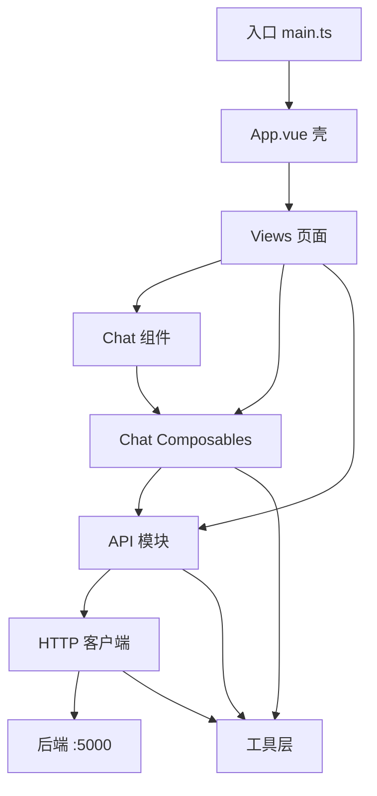
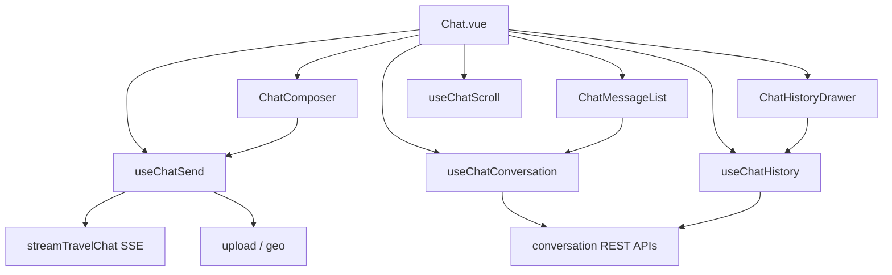

# travel-h5

Vue 3 + Vite + Vant 移动端 H5，核心能力是**行程推荐**与**多模态流式对话**。

## 技术栈

| 类别 | 选型                                        |
| ---- | ------------------------------------------- |
| 框架 | Vue 3.5、Vue Router 4、TypeScript           |
| UI   | Vant 4（自动按需引入）                      |
| 构建 | Vite 8                                      |
| 网络 | Axios（REST）+ 原生 `fetch`（SSE 流式对话） |
| 内容 | marked + DOMPurify（Markdown 渲染）         |

## 快速开始

```bash
npm install
npm run dev      # 开发：默认代理 /api → http://localhost:5000
npm run build    # 类型检查 + 生产构建
npm run preview  # 预览构建产物
```

开发时需本地后端监听 `5000` 端口（见 `vite.config.ts` 中的 proxy）。

## 分层架构

```
入口 (index.html → main.ts)
  └─ 应用壳 (App.vue：router-view + van-tabbar)
       └─ 页面 Views
            ├─ Chat 组件 (components/chat/*)
            ├─ Chat Composables (业务编排)
            └─ API 模块 (auth.ts / travel.ts)
                 ├─ HTTP 客户端 (axiosRequest + fetch SSE)
                 │    └─ 后端 /api → :5000
                 └─ 工具层 (auth / clientId / markdown / geo / compress)
```

依赖关系示意：



## 目录结构

```
src/
├── main.ts                 # 应用入口
├── App.vue                 # 路由出口 + 底部 TabBar
├── router/index.ts         # 路由定义
├── views/                  # 页面
│   ├── Home.vue            # 推荐入口
│   ├── Chat.vue            # 流式对话（核心）
│   ├── Profile.vue         # 我的
│   ├── Login.vue           # 登录注册
│   ├── Detail.vue          # 行程详情
│   └── PlanRecords.vue     # 行程记录列表
├── components/chat/        # 对话 UI
│   ├── ChatComposer.vue
│   ├── ChatMessageList.vue
│   ├── ChatHistoryDrawer.vue
│   └── ChatContextMenu.vue
├── composables/chat/       # 对话业务编排
│   ├── useChatConversation.ts
│   ├── useChatSend.ts
│   ├── useChatHistory.ts
│   ├── useChatScroll.ts
│   ├── scenes.ts
│   ├── types.ts
│   └── utils.ts
├── api/
│   ├── axiosRequest.ts     # Axios 实例与拦截器
│   ├── auth.ts             # 鉴权 API
│   └── travel.ts           # 行程 / 对话 / 上传 / SSE
└── utils/
    ├── auth.ts             # Token 会话
    ├── clientId.ts         # X-Client-Id
    ├── markdown.ts         # Markdown 安全渲染
    ├── imageCompress.ts    # 图片压缩
    ├── geolocation.ts      # 定位
    └── debounce.ts
```

## 路由与页面

| 路径       | 名称    | 页面        | 职责             | TabBar |
| ---------- | ------- | ----------- | ---------------- | ------ |
| `/`        | home    | Home        | 推荐入口 / 表单  | 显示   |
| `/chat`    | chat    | Chat        | 流式对话（核心） | 显示   |
| `/profile` | profile | Profile     | 用户信息 / 登出  | 显示   |
| `/login`   | login   | Login       | 登录注册         | 隐藏   |
| `/detail`  | detail  | Detail      | 行程详情         | 隐藏   |
| `/plans`   | plans   | PlanRecords | 行程记录列表     | 隐藏   |

`App.vue` 根据 `route.meta.hideTabbar` 控制底部导航显隐。

## API 面

### 鉴权 `api/auth.ts`

- `register` / `login` / `fetchMe` / `logout`

### 行程与对话 `api/travel.ts`

**REST**

- `fetchTravelRecommend` — 行程推荐
- `fetchPlans` / `fetchPlanDetail` / `deletePlan` — 行程记录
- `fetchConversations` / `fetchConversationDetail` / `createConversation` / `updateConversation` / `deleteConversation` — 会话管理
- `uploadTravelImage` — 图片上传
- `reverseGeocodeLocation` — 逆地理编码

**SSE（原生 fetch）**

- `streamTravelChat` → `POST /api/travel/chat`  
  按 SSE 逐段回调 `content`；可传 `conversationId` 续聊，省略则后端新建并在 `done` 中回传 id。

### HTTP 客户端 `api/axiosRequest.ts`

- `baseURL: /api`
- 请求拦截：注入 `Authorization: Bearer <token>`、`X-Client-Id`
- 响应拦截：校验 `status === ok`；`401` 时清除本地会话

## Chat 模块数据流

`Chat.vue` 组装四个 composable：发送走 SSE，会话/历史走 REST。



| Composable            | 职责                                          |
| --------------------- | --------------------------------------------- |
| `useChatConversation` | 当前会话绑定、历史消息加载、路由同步          |
| `useChatSend`         | 输入草稿、附件、场景快捷入口、流式发送 / 停止 |
| `useChatHistory`      | 会话列表抽屉、置顶 / 重命名 / 删除            |
| `useChatScroll`       | 贴底滚动与用户上滑打断                        |

## 横切能力

| 能力       | 实现                                                     |
| ---------- | -------------------------------------------------------- |
| 鉴权       | `utils/auth` Token 存取；拦截器注入 `Authorization`      |
| 客户端标识 | `utils/clientId` → 请求头 `X-Client-Id`                  |
| 多模态     | `imageCompress` → `uploadTravelImage` → `sceneHint` 加权 |
| 内容渲染   | `marked` + `DOMPurify` → `renderMarkdown`                |
| 定位       | `geolocation` + 可选 `reverseGeocodeLocation`            |
